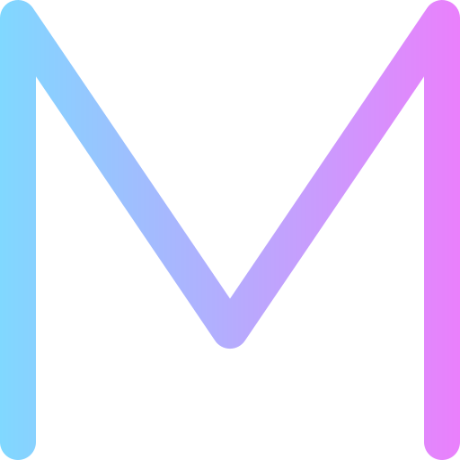

# <a href="https://www.maragil.com" target="_blank" rel="noreferrer">  Bienvenidos a mi Porfolio!

🙌🏻 Hola! Soy María Araujo Gil y en este espacio digital muestro la variedad de proyectos que he realizado, donde quiero dejar reflejadas mi creatividad, habilidades técnicas y dedicación al mundo de la programación. Soy una desarrolladora web motivada por el aprendizaje y la creación de experiencias interactivas y atractivas.

## 🔎 ¿Qué encontrarás aquí?

En él encontrarás una colección de proyectos personales. Cada uno de ellos ha sido cuidadosamente desarrollado para ofrecer soluciones prácticas y atractivas a diferentes desafíos. Junto con mis proyectos, también podrás acceder a mi [CV](https://drive.google.com/file/d/10o8RU52tN787RjLF5TvUAIs-Zd5tM2qg/view) actualizado para conocer más detalles sobre mi experiencia y habilidades.

Este porforlio está diseñado de manera responsive y es un documento vivo al que voy añadiendo proyectos y funcionalidades nuevas según van surgiendo. 

## 📑	Instrucciones de uso

### 🔹Navegación rápida.

En la barra de navegación se encuentran enlaces directos a diferentes secciones de mi porfolio:

- **Proyectos:** Acceso a la sección de proyectos ubicada más abajo, donde se pueden explorar y descubrir detalles de cada uno de ellos.
- **CV:** Al hacer click en ese enlace podrás acceder a mi currículum actualizado para obtener más información sobre mi experiencia y habilidades.
- **Contacto:** Para comunicarte conmigo solo tendrás que dirigirte al formulario de contacto y enviarme un correo.

### 🔹Redes sociales.

Los iconos de redes sociales que encontrarás en mi portfolio son funcionales. Cada uno de ellos es un enlace directo a mis perfiles en distintas plataformas, como [GitHub](https://github.com/maragil), [Linkedin](https://www.linkedin.com/in/maria-araujo-gil/) y [Twitter](https://twitter.com/araujomaria84).. Al hacer clic en ellos, se abrirá una nueva ventana, lo que te permitirá seguirme y mantenerte al tanto de mis últimas novedades.

### 🔹Scroll Fácil.

En la parte inferior derecha de la pantalla, he incorporado una flecha de scroll, la cual te permite regresar rápidamente al inicio de la página desde cualquier punto.

Cada proyecto tiene un título que es un enlace a su web, una imagen con una vista previa, un enlace al repositorio de GitHub correspondiente y el detalle de las tecnologías empleadas en cada uno de ellos.

Si tienes alguna pregunta, duda o interés, no dudes en ponerte en contacto a través del formulario que encontrarás en él.

## 🚀 Comenzando 

 Este proyecto se inició con la aplicación [Create React App](https://github.com/facebook/create-react-app).

 Para levantar el proyecto se debe ejecutar el comando: `npm start`

### 💾 Scripts Disponibles

En el proyecto se encuentran disponibles los siguientes scripts:

- `saveCname`
- `cleanDocs` : borra el archivo docs.
- `build2docs` : mueve el archivo build a docs.
- `restoreCname` : restaura el Cname.
- `docs` : ejecuta todos los comandos anteriores.

Runs the app in the development mode.\
Open [http://localhost:3000](http://localhost:3000) to view it in your browser.

The page will reload when you make changes.\
You may also see any lint errors in the console.

### `npm test`

Launches the test runner in the interactive watch mode.\
See the section about [running tests](https://facebook.github.io/create-react-app/docs/running-tests) for more information.

### `npm run build`

Builds the app for production to the `build` folder.\
It correctly bundles React in production mode and optimizes the build for the best performance.

The build is minified and the filenames include the hashes.\
Your app is ready to be deployed!

See the section about [deployment](https://facebook.github.io/create-react-app/docs/deployment) for more information.

### `npm run eject`

## 📦 Despliegue 

_Agrega notas adicionales sobre como hacer deploy_

## 🛠️ Construido con 

Estas son las herramientas empleadas para la realización del Porfolio:

* [Bootstrap](https://getbootstrap.esdocu.com/) - El framework usado para el diseño de la web.
* [React](https://es.react.dev/) - El framework usado para las funcionalidades de la web.
* [Maven](https://maven.apache.org/) - Manejador de dependencias

HookForm
Emailjs
ScrollToTop
